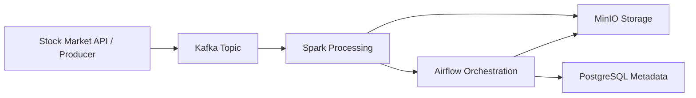
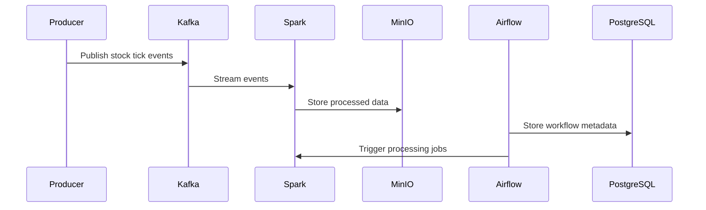

# Stock Market Data Pipeline

A production-ready, containerized data engineering pipeline for ingesting, streaming, processing, orchestrating, and storing stock market data using Kafka, Spark, Airflow, PostgreSQL, and MinIO.

## Overview

This project demonstrates a modern event-driven architecture for collecting stock market data, publishing it to Kafka, processing it with Spark, orchestrating workflows with Airflow, and persisting raw or processed data in MinIO.

The solution is designed for:
- Real-time data ingestion
- Scalable event streaming
- Batch and streaming analytics
- Workflow orchestration
- Persistent storage for analytics workloads

## Architecture Diagram



## Data Flow Diagram



## Components

### 1. Producer
- Reads stock market data from a provider API
- Publishes events to Kafka topics
- Configured as a standalone container service

### 2. Kafka
- Handles streaming event transport
- Uses Kafka KRaft mode for broker/controller coordination
- Supports topic-based event distribution

### 3. Spark
- Consumes streamed data from Kafka
- Performs transformations and analytics
- Writes results to object storage or downstream systems

### 4. Airflow
- Orchestrates data pipelines and scheduling
- Stores metadata in PostgreSQL
- Enables monitoring and DAG-based workflow management

### 5. MinIO
- Provides S3-compatible object storage
- Stores processed data and artifacts

### 6. PostgreSQL
- Stores Airflow metadata and operational state

## Project Structure

```text
.
├── airflow/
├── docker/
│   ├── airflow/
│   ├── kafka/
│   ├── producer/
│   └── spark/
├── producer/
├── spark/
├── storage/
├── docker-compose.yml
├── requirements.txt
└── README.md
```

## Prerequisites

Make sure the following are installed on your machine:
- Docker
- Docker Compose
- Git

## Quick Start

1. Clone the repository
   ```bash
   git clone <repository-url>
   cd "Stock market data"
   ```

2. Start the services
   ```bash
   docker compose up --build
   ```

3. Access the services
   - Airflow UI: http://localhost:8080
   - Kafka: localhost:9094
   - MinIO Console: http://localhost:9001
   - PostgreSQL: localhost:5432

## Service Configuration

| Service | Port | Purpose |
| --- | --- | --- |
| Airflow | 8080 | Workflow orchestration UI |
| Kafka | 9092, 9094 | Event streaming |
| MinIO | 9000, 9001 | Object storage |
| PostgreSQL | 5432 | Airflow metadata database |

## Environment Variables

The stack uses the following core environment settings:
- Kafka: KRaft mode with controller and broker roles
- Airflow: PostgreSQL-backed metadata database
- MinIO: default root credentials for local development

## Useful Commands

```bash
# Start all services
docker compose up --build

# Stop all services
docker compose down

# View running containers
docker compose ps

# View logs
docker compose logs -f
```

## Notes

- This setup is intended for local development and testing.
- For production use, secure credentials, networking, and persistent storage policies should be hardened.
- Airflow metadata is stored in PostgreSQL rather than SQLite for better reliability.

## License

This project is licensed under the MIT License. See the LICENSE file for details.
