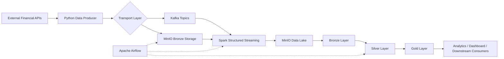

# Real-Time Stock Market Data Engineering Pipeline


## Project Overview

This repository contains a data engineering pipeline built for stock market data ingestion, processing, and storage. The pipeline ingests financial data from REST APIs, persists raw payloads into MinIO, and processes the data with Apache Spark. It also includes Kafka-based streaming support and Airflow orchestration for batch workflows.

The project is designed to demonstrate practical data engineering architecture with layered storage, stateful ingestion, schema management, and containerized local development.

## Key Features

- REST API ingestion for stock market data
- Batch processing using Apache Spark
- Kafka support for streaming transport
- MinIO S3-compatible data lake storage
- Bronze / Silver / Gold medallion architecture
- Airflow orchestration readiness
- Environment-driven configuration
- Docker Compose local development
- API retry and error handling
- State management for incremental ingestion
- Parquet optimized storage
- Modular code organization

## System Architecture



## Data Flow

1. API extraction from external financial APIs.
2. Validation and serialization of incoming data.
3. Kafka publishing where applicable for streaming.
4. Raw data storage into MinIO Bronze layer.
5. Spark ingestion from Bronze or Kafka.
6. Schema enforcement and type casting.
7. Data cleaning and normalization.
8. Deduplication before write operations.
9. Parquet conversion for analytics-ready storage.
10. Silver and Gold layer materialization.
11. Airflow orchestration for batch workflows.
12. Monitoring and logging for observability.

## Data Lake Architecture

| Layer | Purpose | Data Format | Data Quality | Example |
| --- | --- | --- | --- | --- |
| Bronze | Raw landing zone with source fidelity | JSON | Minimal transformation | Raw Finnhub API responses for candles, news, earnings |
| Silver | Cleaned and standardized data | Parquet | Schema enforcement, normalization | Standardized OHLCV and profile datasets |
| Gold | Business-ready analytics datasets | Parquet | Deduplicated, aggregated, analytics-ready | Daily price performance and market summaries |

## Project Structure

The repository is organized to separate ingestion, storage, processing, and orchestration.

- `producer/` — API client, ingestion logic, state management, and MinIO/Kafka utilities
- `spark/` — Spark session configuration and batch/streaming job code
- `Minio_client/` — MinIO connection, reader, and writer utilities
- `airflow/` — Airflow service requirements and DAG scaffolding
- `docker/` — Dockerfiles for producer, Spark, Airflow, and Streamlit services
- `kafka/` — Kafka runtime resources and helper files
- `storage/` — Storage layer layout references
- `streamlit_dashboard/` — Dashboard scaffold
- `docker-compose.yml` — Local service orchestration
- `.env` — Environment configuration for local services
- `LICENSE` — MIT license
- `requirements.txt` — Python dependency list

## Data Domains

| Domain | Data Type | Example Fields | Processing Purpose |
| --- | --- | --- | --- |
| Quotes | Real-time quote updates | symbol, current price, open, high, low, timestamp | Track live price movements |
| Candles / OHLCV | Historical price series | symbol, open, high, low, close, volume, date | Build time-series analytics |
| Company Profiles | Company metadata | symbol, industry, exchange, country | Enrich datasets with company references |
| News | Financial news events | symbol, headline, summary, datetime, source | Support news-driven analytics |
| Earnings | Earnings report data | symbol, actual, estimate, period, release date | Track corporate earnings events |
| Financials | Statement metrics | symbol, statement type, fiscal period, metrics | Prepare financial statement analytics |
| Market Status | Trading session status | symbol, trading status, open, close | Monitor exchange availability |

## Batch vs Streaming Architecture

**Batch**

- Scheduled ingestion and historical refresh
- Spark batch processing from persisted raw storage
- Airflow orchestration for repeatable workflows

**Streaming**

- Event transport using Kafka
- Spark Structured Streaming for near-real-time processing
- Low-latency updates and continuous ingestion

Both patterns illustrate how a data engineering pipeline can support scheduled batch jobs while also being prepared for streaming event processing.

## Configuration Management

- Environment variables are loaded from `.env`
- API keys and secrets are kept out of source control
- Kafka settings use `KAFKA_BROKER` and topic variables
- MinIO settings use `MINIO_ROOT_USER`, `MINIO_ROOT_PASSWORD`, and `MINIO_ENDPOINT`
- Spark is configured through Docker and session settings
- Use `.env.example` as a reference for required values

## Local Setup

### Prerequisites

- Docker Desktop
- Docker Compose
- Python 3.10+
- Git
- WSL2 / Linux environment recommended
- Recommended hardware: 8 GB RAM, 4 CPU cores, 20 GB disk free

### Setup

```powershell
git clone https://github.com/aashubhamgarg2005-commits/Stock-market-data-pipeline
cd "Stock market data"
```

Create a local environment file:

```powershell
copy .env .env.local
```

Edit `.env.local` and configure at least:

- `STOCK_API_KEY`
- `MINIO_ROOT_USER`
- `MINIO_ROOT_PASSWORD`
- `MINIO_ENDPOINT`
- `KAFKA_BROKER`

### Start services

```powershell
docker compose up -d
```

### Run ingestion and processing

```powershell
docker compose run --rm rest-producer
```

```powershell
docker compose run --rm spark-batch
```

### Service access

- Airflow UI: `http://localhost:8081`
- MinIO console: `http://localhost:9001`
- MinIO API: `http://localhost:9000`
- Kafka broker: `localhost:9092`
- PostgreSQL: `localhost:5432`
- Streamlit dashboard: `http://localhost:8501`

> Never commit `.env` or secret values to GitHub.

## Docker Services

| Service | Purpose | Technology |
| --- | --- | --- |
| `kafka` | Event transport for streaming | Apache Kafka |
| `spark-batch` | Batch Spark job execution | Apache Spark |
| `spark-stream` | Streaming Spark job scaffold | Apache Spark Structured Streaming |
| `minio` | Local S3-compatible object storage | MinIO |
| `airflow` | Workflow orchestration | Apache Airflow |
| `postgres` | Metadata store for Airflow | PostgreSQL |

## Example Commands

- Start services: `docker compose up -d`
- Stop services: `docker compose down`
- Tail logs: `docker compose logs -f kafka`
- Run the producer: `docker compose run --rm rest-producer`
- Run the batch Spark job: `docker compose run --rm spark-batch`
- List Kafka topics: `docker compose exec kafka kafka-topics.sh --bootstrap-server localhost:9092 --list`

## Data Engineering Concepts Demonstrated

- ETL / ELT pipeline design
- Bronze / Silver / Gold data lake architecture
- Batch processing with Spark
- Stream processing scaffolding with Kafka
- Distributed processing
- Schema enforcement
- Parquet optimization
- Data partitioning and deduplication
- Idempotent ingestion and state management
- Fault tolerance with retries and error handling
- Containerized development and orchestration
- Workflow orchestration with Airflow
- Observability-ready architecture

## Engineering Best Practices

- Modular code separation
- Separation of concerns between ingestion, processing, and storage
- Environment-based configuration
- Secure secret management
- Structured logging
- Retry mechanisms for API calls
- Data validation and schema management
- Idempotent processing patterns
- Reproducible environments with Docker
- Incremental state tracking

## Future Improvements

The following items are intended for future development and are not currently implemented:

- Cloud deployment on AWS, Azure, or GCP
- AWS S3 integration instead of local MinIO
- Delta Lake or Apache Iceberg support
- Snowflake or Databricks integration
- Kubernetes deployment
- Prometheus and Grafana production dashboards
- Data quality frameworks such as Great Expectations
- CI/CD pipelines and automated testing
- Data catalog and metadata management
- Alerting for pipeline failures
- Full end-to-end validation tests

## Learning Outcomes

This project demonstrates how to build a modern stock market data pipeline that combines API ingestion, data lake storage, Spark processing, and orchestration. It is designed to communicate the engineering practices needed for scalable data systems.

## License

This project is licensed under the MIT License.

## Disclaimer

This repository is provided for educational and engineering demonstration purposes only. Financial data may be delayed or subject to API limitations. This project does not provide financial advice.


## 👤 Author

**Shubham Garg**

Aspiring Data Engineer passionate about building scalable data pipelines, distributed data processing systems, and cloud-ready data architectures.

- GitHub: [github.com/your-username](https://github.com/aashubhamgarg2005-commits)
- LinkedIn: [linkedin.com/in/your-profile](https://www.linkedin.com/in/shubham-garg-9465b836a)
